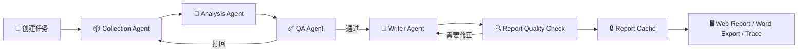
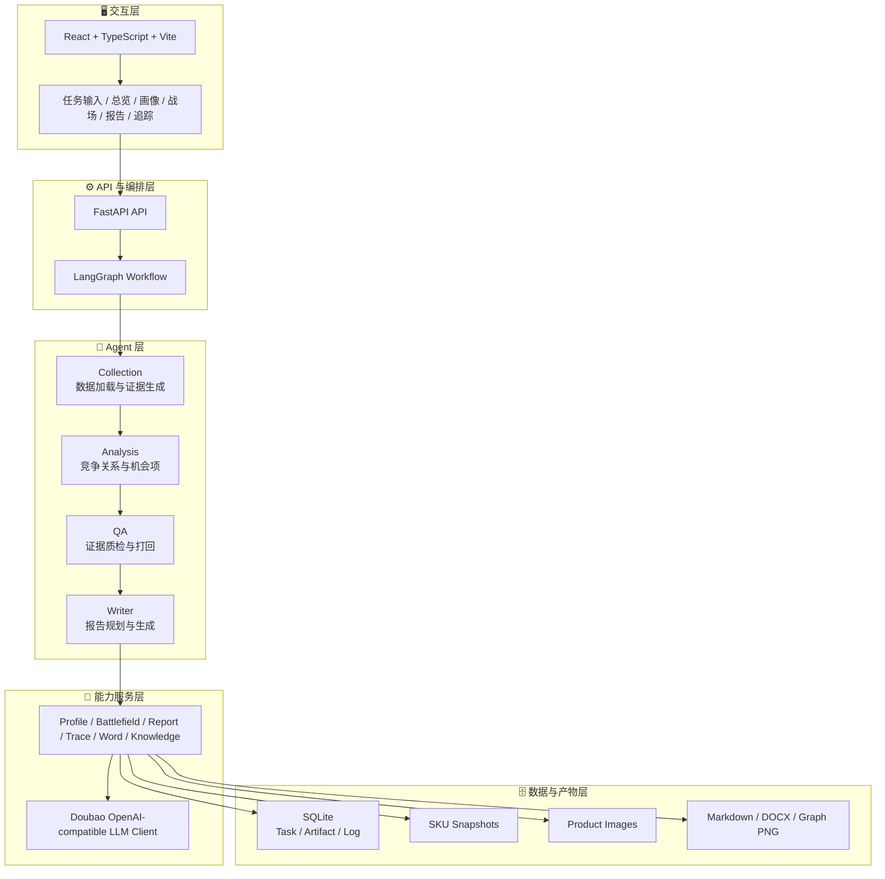

<div align="center">

# CompeteX-Agent

### 竞品分析与竞争关系重建的多 Agent 智能系统

**从商品快照、用户研究和证据链出发，自动重建竞争关系，生成可追溯、可复核、可导出的专业竞品分析报告。**

[](#-技术栈)
[](#-技术栈)
[](#-系统架构)
[](#-技术栈)
[](#-可选-llm-配置)
[](#-当前状态)

</div>

---

## ✨ 项目定位

**CompeteX-Agent 不是一个静态样例，也不是简单的竞品列表生成器。**

它是一个完整的竞品分析 Agent 系统：前端创建任务，后端启动 LangGraph 多 Agent 工作流，系统自动完成数据加载、竞品召回、竞争关系评分、证据质检、报告规划、LLM 生成、报告缓存、Word 导出和过程追踪。

当前仓库以内置的“自动猫砂盆”类目作为可运行基准场景，用真实脱敏 SKU 快照、本地商品图片、评论摘要和用户研究文本验证完整链路。系统架构本身面向更广泛的消费品和互联网产品竞品分析任务，可继续扩展数据源、类目知识库和外部检索能力。

| 🧭 维度 | 说明 |
| --- | --- |
| 🎯 系统目标 | 重建竞争关系，而不是罗列竞品名称 |
| 🧠 Agent 能力 | Collection、Analysis、QA、Writer 多 Agent 协作 |
| 🔎 分析对象 | 商品、价格带、人群、场景、购买理由、证据可信度 |
| 📚 数据基础 | 脱敏 SKU 快照、本地图片、评论摘要、用户研究文本、类目知识 |
| 🧾 输出结果 | 总览、画像、战场、图谱、Trace、网页报告、Word 报告 |
| 🛡️ 治理机制 | 证据绑定、QA 打回、Human Review、敏感信息脱敏 |

---

## 🏆 核心价值

传统竞品分析很容易停留在“谁和谁相似”的层面。CompeteX-Agent 更关注产品经理真正需要回答的问题：

- **谁是最主要竞品？**
- **用户为什么会把它们放在一起比较？**
- **目标产品赢在哪里，风险在哪里？**
- **哪些结论有证据，哪些地方必须继续补证？**
- **下一步应该改页面、补卖点，还是补证据？**

| 传统方式 | CompeteX-Agent |
| --- | --- |
| 📋 竞品清单 | 🕸️ 竞争关系图谱 |
| 🧩 零散素材 | 🔗 Claim-Evidence 证据链 |
| ✍️ 人工写报告 | 🧠 Agent + LLM 章节级报告生成 |
| ❓ 结论难复核 | 🔍 Trace、QA、Diff 全链路追踪 |
| 🔁 每次生成都不同 | 🔒 报告缓存与版本锁定 |
| 🧪 问卷影响不明显 | 📌 用户研究信号进入机会项和行动建议 |

---

## 🎬 可分析场景

| 场景 | 当前能力 | 输出结果 |
| --- | --- | --- |
| 🐾 自动猫砂盆 | 内置完整脱敏 SKU 快照、商品图片、评论摘要和证据链 | 可直接运行端到端分析 |
| 🛒 消费品竞品 | 可复用价格带、人群、场景、卖点、证据可信度建模 | 适合扩展到更多消费品类 |
| 🤖 AI 产品 | 可复用“竞品关系重建 + 用户决策链 + 报告生成”框架 | 需要接入对应产品数据源 |
| 📱 内容平台 | 可复用用户场景、替代关系和渠道型竞争分析 | 需要补充平台类指标与证据 |
| 💼 SaaS 工具 | 可复用功能、价格、目标客户、转化阻力分析 | 需要补充 B 端采购链路知识 |

> 当前提交版本提供的是完整可运行系统，自动猫砂盆是内置验证场景；不是把系统能力限定为单一场景。

---

## 🧩 系统能力全景

| 模块 | 能力说明 |
| --- | --- |
| 🧾 任务创建 | 前端创建分析任务，后端写入 SQLite，并启动后台 LangGraph 工作流 |
| 📦 数据加载 | 读取脱敏 SKU 快照、本地商品图片、评论摘要和用户研究文本 |
| 🧠 竞品召回 | 按产品类型、价格带、卖点、人群和使用场景识别竞争对象 |
| 🕸️ 竞争关系 | 构建 CompetitionEdge，解释“谁在什么条件下构成竞争” |
| 🎚️ 动态切片 | 支持价格带、人群、使用场景切换，观察竞争关系变化 |
| ✅ QA 打回 | 检查证据缺口、访问时间、截图、敏感表达和推断边界 |
| 🔁 局部重算 | QA 或 Human Review 后触发局部重算，并记录 Diff |
| 📊 态势总览 | 输出总体判断、关键竞品、风险机会和下一步行动 |
| 🧬 产品画像 | 展示目标产品能力树、证据摘要、价格和竞品横向对比 |
| 🗺️ 竞争战场 | 展示关键竞品、关系解释、证据卡片和决策链重点 |
| 📝 报告生成 | 章节级 LLM 生成，强调连续分析而非结构化字段堆砌 |
| 🔒 报告缓存 | 一个任务完成后报告固定保存，刷新和下载读取同一份报告 |
| 📄 Word 导出 | 生成真实 `.docx` 文件，同级标题、正文、列表和表格样式统一 |
| 🧭 Trace 追踪 | 展示 Agent 流程、QA 记录、证据链、Human Review Diff 和质检结果 |
| 🛡️ 安全合规 | API Key 不进入代码、日志、Trace、截图或导出报告 |

---

## 🧠 Agent 工作流



### 1. 📦 Collection Agent

加载本地脱敏 SKU 快照、商品主图、评论摘要和用户研究文本，生成 `Product`、`Evidence`、`ReviewInsight` 等结构化对象。

### 2. 🧠 Analysis Agent

构建产品画像、价格模型、用户画像、竞争边、Battlecard、Gap Matrix、Opportunity Item 和 Review Signal Cluster。
问卷文本会被转成痛点、购买理由、异议、信任、维护成本、安全顾虑等信号，影响报告侧重点和行动建议，但不会凭空改写价格、销量或安全事实。

### 3. ✅ QA Agent

检查证据完整性、访问时间、截图、敏感表达、推断标注和缺失字段。发现问题时产生真实打回，触发补证或局部重算。

### 4. 📝 Writer Agent

先做报告总编排，聚合 3 到 5 个核心主题，再按正式章节生成连续分析。
LLM 可输出 JSON 结构化段落；无 Key 时自动降级为本地规则。

### 5. 🔍 Report Quality Check

检查报告是否冗余、是否像人话、是否出现内部 ID、是否证据不足却写得过满。失败段落最多二次修正一次，避免无限调用。

---

## 🏗️ 系统架构



---

## 🖥️ 前端页面

| 页面 | 用户看到什么 |
| --- | --- |
| 🧾 任务输入 | 创建新任务，输入用户研究文本；任务完成后保留当前结果入口 |
| 📊 竞争态势总览 | 总体判断、关键竞品、风险机会、行动建议 |
| 🧬 产品画像 | 能力树、证据摘要、目标产品与竞品横向对比 |
| 🗺️ 竞争战场 | 关键竞品卡片、商品主图、切片解释、证据卡片 |
| 📝 分析报告 | 锁定后的正式报告，支持重新生成和 Word 下载 |
| 🧭 过程追踪 | Agent 做了什么、QA 打回什么、证据链如何支撑结论 |

---

## 📑 报告生成策略

报告不是逐条 `edge/item` 生硬堆叠，而是两层生成：

1. **报告总编排**
   先从所有竞品、切片、证据和用户研究中聚合核心主题，例如主要竞品、比较原因、目标产品优势、最大风险、待补证据。

2. **正式章节生成**
   再按执行摘要、竞争格局、核心竞品、用户决策链、行动建议等章节生成连续分析。

| 章节 | 目标 |
| --- | --- |
| 🧭 执行摘要 | 用 3 条结论说明本次分析最重要发现 |
| 🕸️ 竞争格局 | 按价格带、人群和场景解释竞争压力 |
| 🥊 核心竞品 | 只讲最重要的 3 个左右竞品，说明为什么会被比较 |
| 🧠 用户决策链 | 把结构化字段翻译成真实购买阶段 |
| 📌 行动建议 | 明确该改页面、补证据、优化卖点还是复核风险 |

---

## 🚀 快速开始

### 环境要求

| 环境 | 版本建议 |
| --- | --- |
| 🐍 Python | 3.12 |
| 🟢 Node.js | 18+ |
| 📦 npm | 9+ |
| 🧠 LLM | 可选，Doubao-Seed-2.0-lite |

### 1. 克隆项目

```bash
git clone https://github.com/Moonsqueaks/CompeteX-Agent.git
cd CompeteX-Agent
```

### 2. 启动后端

```powershell
cd backend
python -m venv .venv
.\.venv\Scripts\Activate.ps1
python -m pip install -r requirements-dev.txt
python -m uvicorn app.main:app --host 127.0.0.1 --port 8000 --reload
```

后端健康检查：

```text
http://127.0.0.1:8000/health
```

API 文档：

```text
http://127.0.0.1:8000/docs
```

### 3. 启动前端

```powershell
cd frontend
npm install
npm run dev
```

访问地址：

```text
http://127.0.0.1:5173
```

---

## 🧠 可选 LLM 配置

在 `backend/.env` 中配置本地密钥。真实 Key 不要提交到 Git。

```env
LLM_ENABLED=true
LLM_PROVIDER=doubao
DOUBAO_API_KEY=你的本地 Key
DOUBAO_BASE_URL=OpenAI-compatible Base URL
DOUBAO_MODEL=Doubao-Seed-2.0-lite
LLM_TIMEOUT_SECONDS=30
LLM_MAX_RETRIES=2
```

| 配置项 | 说明 |
| --- | --- |
| 🔑 `DOUBAO_API_KEY` | 本地 API Key，只从 `.env` 读取 |
| 🌐 `DOUBAO_BASE_URL` | OpenAI-compatible Base URL |
| 🧠 `DOUBAO_MODEL` | 默认使用 `Doubao-Seed-2.0-lite` |
| ⏱️ `LLM_TIMEOUT_SECONDS` | 单次请求超时 |
| 🔁 `LLM_MAX_RETRIES` | 最大重试次数，降低 429 或临时失败影响 |

未配置 Key 时，系统自动降级为本地规则生成，完整链路仍可运行。

---

## ⚡ 快速体验

1. 打开前端：`http://127.0.0.1:5173`
2. 创建分析任务，可选择填写一段用户研究文本。
3. 任务完成后依次查看：
   - 📊 竞争态势总览
   - 🧬 产品画像
   - 🗺️ 竞争战场
   - 📝 分析报告
   - 🧭 过程追踪
4. 下载 Word 报告，检查章节、正文和表格字体是否统一。
5. 回到任务输入页，已完成任务会保留当前结果；点击“创建新的分析任务”才会重新开始。

推荐观察点：

- 🕸️ 系统如何从商品快照重建竞争关系。
- 🔗 每条关键判断如何绑定证据。
- ✅ QA Agent 如何发现缺口并触发打回。
- 🧠 LLM 如何参与报告段落生成和质量修正。
- 🔒 报告为什么刷新后不变，Word 为什么读取同一份缓存。

---

## 🔌 API 概览

| 方法 | 路径 | 说明 |
| --- | --- | --- |
| 🟢 GET | `/health` | 后端健康检查 |
| 🟣 POST | `/tasks` | 创建分析任务 |
| 🟢 GET | `/tasks/{task_id}` | 查询任务状态 |
| 🟢 GET | `/tasks/{task_id}/overview` | 获取竞争态势总览 |
| 🟢 GET | `/tasks/{task_id}/profile` | 获取产品画像 |
| 🟢 GET | `/tasks/{task_id}/battlefield` | 获取竞争战场数据 |
| 🟢 GET | `/tasks/{task_id}/report` | 获取缓存后的分析报告 |
| 🟣 POST | `/tasks/{task_id}/report/regenerate` | 重新生成并锁定报告 |
| 🟢 GET | `/tasks/{task_id}/report/docx` | 下载 Word 报告 |
| 🟢 GET | `/tasks/{task_id}/trace` | 获取 Agent 过程追踪 |
| 🟣 POST | `/tasks/{task_id}/feedback` | 提交 Human Review 修正 |

---

## 📂 项目结构

```text
CompeteX-Agent/
├─ backend/
│  ├─ app/
│  │  ├─ api/          # FastAPI 路由与统一响应
│  │  ├─ agents/       # Collection / Analysis / QA / Writer
│  │  ├─ graph/        # LangGraph 状态、节点和工作流
│  │  ├─ schemas/      # Pydantic v2 结构化数据模型
│  │  ├─ services/     # LLM、报告、Word、画像、战场、Trace、知识检索等服务
│  │  ├─ storage/      # SQLite、SQLAlchemy 仓储和模型
│  │  └─ main.py       # FastAPI 入口
│  ├─ tests/           # 后端测试
│  └─ requirements-dev.txt
├─ frontend/
│  ├─ src/
│  │  ├─ app/          # 路由、布局和 Provider
│  │  ├─ api/          # API Client 和类型
│  │  ├─ components/   # 通用组件
│  │  ├─ pages/        # Task / Overview / Profile / Battlefield / Report / Trace
│  │  ├─ domain/       # 中文标签和业务映射
│  │  └─ utils/        # 格式化、北京时间、可读文本工具
│  ├─ e2e/             # Playwright 测试
│  └─ package.json
├─ data/
│  ├─ snapshots/       # 脱敏 SKU 快照和数据质量说明
│  ├─ raw/             # 本地商品图片素材
│  └─ reports/         # Markdown、Word 和图谱输出
├─ memory-bank/        # 架构、设计、计划、进度和交接文档
├─ docs/               # 项目文档
```

---

## 🛠️ 技术栈

| 层级 | 技术 |
| --- | --- |
| ⚙️ 后端 | Python 3.12、FastAPI、LangGraph、Pydantic v2、SQLite、SQLAlchemy |
| 🖥️ 前端 | React、TypeScript、Vite、Ant Design、TanStack Query、React Flow、lucide-react |
| 🧠 LLM | Doubao-Seed-2.0-lite via OpenAI-compatible API，可选增强 |
| 📄 文档导出 | python-docx |
| 🖼️ 图像与图谱 | Pillow、本地商品图片素材、关系图渲染 |
| 🧪 测试 | Pytest、httpx、Vitest、Testing Library、Playwright |
| 🧹 质量工具 | Ruff、ESLint、Prettier |

---

## ✅ 测试与质量检查

后端：

```powershell
cd backend
python -m pytest
python -m ruff check .
```

前端：

```powershell
cd frontend
npm run test
npm run build
npm run lint
```

---

## 🛡️ 数据与合规边界

- 🔐 API Key 只从本地 `.env` 读取，不写入代码、日志、Trace、截图、README 或导出报告。
- 🧾 报告涉及宠物安全、电器认证、价格、销量、排名等内容时，必须以证据为准。
- 🚫 找不到可靠证据时使用“暂无可靠数据”或提示需要复核，不凭空补事实。
- 🧠 用户研究文本只影响痛点、购买理由和行动建议，不直接改写市场事实。
- 🕒 前端默认以北京时间展示，后端仍以 UTC 存储时间。
- 🌐 `snapshot_plus_live` 当前是已知 URL 增强能力，不宣称实时全网采集。

---

## 🚦 当前状态

CompeteX-Agent 当前已经具备完整端到端系统能力：

| 状态 | 能力 |
| --- | --- |
| ✅ 已完成 | 任务创建、后台工作流、SQLite 持久化 |
| ✅ 已完成 | Collection / Analysis / QA / Writer 多 Agent DAG |
| ✅ 已完成 | 竞争关系重建、动态切片、产品画像、竞争战场 |
| ✅ 已完成 | 证据链、QA 打回、Human Review、局部重算 |
| ✅ 已完成 | LLM Client、章节级报告生成、报告质检、二次修正 |
| ✅ 已完成 | 报告缓存、重新生成、Word 导出、统一字体 |
| ✅ 已完成 | Trace 过程追踪、敏感信息脱敏、北京时间显示 |
| 🔭 可扩展 | 更多品类、更多数据源、联网检索、企业级权限治理 |

系统当前以内置类目作为可验证运行场景，不等同于只做了静态样例。后续扩展重点是更多品类数据接入、来源可信度管理、外部知识检索和更严格的生产级权限治理。
