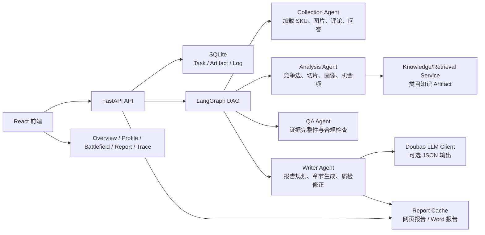

<div align="center">

# CompeteX-Agent

### 竞品分析与竞争关系重建多 Agent 协作系统

**LangGraph 多 Agent DAG · 证据链与 QA 打回 · 竞争关系重建 · LLM 报告生成 · Word 导出**

[](#技术栈)
[](#技术栈)
[](#系统架构)
[](#技术栈)
[](#可选-llm-配置)
[](#当前状态)

</div>

---

## 项目信息

| 项目 | 信息 |
| --- | --- |
| 项目名称 | CompeteX-Agent |
| 赛题方向 | AI 驱动的竞品分析 Agent 协作系统 |
| 核心目标 | 从“竞品列表”升级为“竞争关系重建”，解释谁在什么条件下构成竞争 |
| 演示类目 | 自动猫砂盆 |
| 数据基础 | 用户提供的真实脱敏 SKU 快照、本地图片素材、评论摘要和可选用户研究文本 |
| 当前状态 | MVP 可用 Demo，适合本地评审体验和答辩演示 |
| GitHub | [Moonsqueaks/CompeteX-Agent](https://github.com/Moonsqueaks/CompeteX-Agent) |

---

## 项目简介

CompeteX-Agent 是一个面向产品和运营决策的竞品分析系统。它不是简单列出相似商品，而是围绕价格带、人群、使用场景、购买理由、证据可信度和用户决策链，重建目标产品与竞品之间的竞争关系。

系统以自动猫砂盆类目为 Demo 主线，使用脱敏 SKU 快照和本地证据材料，经过 Collection、Analysis、QA、Writer 多 Agent 协作，输出竞争态势总览、产品画像、竞争战场、过程追踪、网页报告和 Word 报告。

如果配置 Doubao-Seed-2.0-lite，系统会使用大模型做报告段落生成、评论/卖点洞察抽取、质量检查和二次修正；如果没有配置 API Key，也会自动降级为本地规则，保证完整 Demo 可以跑通。

## 解决的问题

| 传统竞品分析问题 | CompeteX-Agent 的做法 |
| --- | --- |
| 只罗列竞品，缺少“为什么竞争”的解释 | 用价格带、人群、使用场景和决策阶段构建 CompetitionEdge |
| 报告结论难追溯 | Claim 与 Evidence 绑定，Trace 展示 Agent 步骤、QA 记录和 Human Review Diff |
| 数据缺失时容易写满、写过头 | QA Agent 检查证据缺口，Writer 和质检逻辑限制无证据断言 |
| 每次打开报告内容可能变化 | 任务完成后锁定报告缓存，刷新、切页和下载 Word 都读取同一份报告 |
| 问卷文本对结果没有可见影响 | 用户研究文本会进入 ReviewSignalCluster 和 OpportunityItem，影响报告侧重点和行动建议 |
| 导出的 Word 样式不统一 | Word 导出统一设置同级标题、正文、列表和表格字体 |

---

## 核心功能

1. **多 Agent 端到端分析流程**  
   Collection、Analysis、QA、Writer 通过 LangGraph DAG 协作，完成数据加载、竞争关系计算、质量检查和报告生成。

2. **竞争关系重建**  
   系统按价格带、人群、场景和决策阶段识别直接竞品、替代方案和渠道型竞争对象，并给出竞争强度和解释。

3. **证据链与 QA 打回**  
   关键判断绑定 Evidence。QA Agent 会检查证据缺失、访问时间、截图、敏感表达和推断标注，必要时触发补证或局部重算。

4. **LLM 报告生成与质检闭环**  
   Writer 先做报告总编排，聚合 3 到 5 个核心主题，再按正式章节生成连续分析。质量 LLM 检查冗余、内部字段、证据不足和语言可读性，失败段落最多二次修正一次。

5. **报告缓存与版本锁定**  
   一个任务完成后报告只生成一次。用户刷新页面、切换页面、下载 Word 都读取同一份报告，只有点击“重新生成报告”才会再次调用生成逻辑。

6. **知识检索与用户研究信号**  
   Knowledge/Retrieval Service 将类目常识转成可审计的 knowledge artifact。问卷和用户研究文本会被抽取为痛点、购买理由、异议、信任、维护成本和安全顾虑。

7. **可视化前端体验**  
   前端提供任务输入、竞争态势总览、产品画像、竞争战场、分析报告、过程追踪等页面，支持商品主图展示、中文可读文本和北京时间显示。

8. **Word 导出**  
   后端生成真实 `.docx` 文件，导出内容优先使用锁定后的 narrative report，并统一同级别字体样式。

---

## 系统架构



## Agent 工作流

1. **创建任务**：前端提交分析任务，后端写入 SQLite，并启动后台 LangGraph 工作流。
2. **Collection**：读取 `data/snapshots/demo_sku_snapshot.json`、本地图片、评论摘要和用户研究文本，生成 Product、Evidence、ReviewInsight。
3. **Analysis**：生成 FeatureTree、PricingModel、UserPersona、CompetitionEdge、StrategyBrief、Battlecard、GapMatrix、OpportunityItem、ReviewSignalCluster。
4. **QA**：检查 Evidence 缺口、访问时间、截图、敏感表达、推断标注和报告边界，触发真实打回。
5. **Writer**：先规划报告主题，再生成执行摘要、竞争格局、核心竞品、用户决策链和行动建议。
6. **Trace / Human Review**：展示 Agent 流程、QA 记录、证据链、报告质检和人工修正 Diff。人工修正后触发局部重算。

---

## 快速开始

### 环境要求

- Python 3.12
- Node.js 与 npm
- Windows PowerShell、macOS Terminal 或 Linux shell
- 可选：Doubao-Seed-2.0-lite API Key

### 1. 克隆项目

```bash
git clone https://github.com/Moonsqueaks/CompeteX-Agent.git
cd CompeteX-Agent
```

### 2. 启动后端

```powershell
cd backend
python -m venv .venv
.\.venv\Scripts\Activate.ps1
python -m pip install -r requirements-dev.txt
python -m uvicorn app.main:app --host 127.0.0.1 --port 8000 --reload
```

后端健康检查：

```text
http://127.0.0.1:8000/health
```

API 文档：

```text
http://127.0.0.1:8000/docs
```

### 3. 启动前端

```powershell
cd frontend
npm install
npm run dev
```

访问地址：

```text
http://127.0.0.1:5173
```

### 可选 LLM 配置

在 `backend/.env` 中配置本地密钥。真实 Key 不要提交到 Git。

```env
LLM_ENABLED=true
LLM_PROVIDER=doubao
DOUBAO_API_KEY=你的本地 Key
DOUBAO_BASE_URL=OpenAI-compatible Base URL
DOUBAO_MODEL=Doubao-Seed-2.0-lite
LLM_TIMEOUT_SECONDS=30
LLM_MAX_RETRIES=2
```

说明：`DOUBAO_BASE_URL` 应填写实际 OpenAI-compatible Base URL，而不是把 API Key 写入代码、README、Trace 或导出报告。

---

## 评委快速体验

1. 打开前端：`http://127.0.0.1:5173`
2. 在任务输入页创建 Demo 分析任务，可选填入用户研究文本或问卷摘要。
3. 等待任务完成后，查看以下页面：
   - **竞争态势总览**：总体判断、关键竞品、风险机会和行动建议。
   - **产品画像**：目标产品能力、证据摘要、竞品横向对比。
   - **竞争战场**：按价格带、人群、场景切换竞争关系。
   - **分析报告**：查看锁定后的正式网页报告，支持重新生成和下载 Word。
   - **过程追踪**：查看 Agent 流程、QA 打回、证据链、Human Review Diff 和报告质检。
4. 回到任务输入页时，已完成任务会保留当前结果；点击“创建新的分析任务”才会重新开始新流程。

推荐演示重点：

- 不是“竞品列表”，而是“谁在什么条件下构成竞争”。
- QA 打回和 Human Review 是真实闭环，不只是静态展示。
- 报告生成一次后会锁定，避免刷新后内容变化。
- 问卷文本会影响报告侧重点和行动建议，但不会凭空改写价格、销量或安全事实。

---

## 页面能力

| 页面 | 能力 |
| --- | --- |
| Task Input | 创建分析任务，支持 Demo 快照、已知公开 URL 增强占位和用户研究文本输入 |
| Overview | 一屏展示竞争态势、关键竞品、机会风险和下一步行动 |
| Profile | 展示目标产品画像、能力树、证据摘要、价格和竞品对比 |
| Battlefield | 展示竞争关系、关键竞品、切片筛选、关系解释和证据卡片 |
| Report | 展示正式分析报告，支持报告轮询、缓存锁定、重新生成和 Word 下载 |
| Trace | 以用户可理解语言展示 Agent 运行步骤、QA、证据链、Diff 和质检记录 |

## API 概览

| 方法 | 路径 | 说明 |
| --- | --- | --- |
| GET | `/health` | 后端健康检查 |
| POST | `/tasks` | 创建分析任务 |
| GET | `/tasks/{task_id}` | 查询任务状态 |
| GET | `/tasks/{task_id}/overview` | 获取竞争态势总览 |
| GET | `/tasks/{task_id}/profile` | 获取产品画像 |
| GET | `/tasks/{task_id}/battlefield` | 获取竞争战场数据 |
| GET | `/tasks/{task_id}/report` | 获取缓存后的分析报告 |
| POST | `/tasks/{task_id}/report/regenerate` | 重新生成并锁定报告 |
| GET | `/tasks/{task_id}/report/docx` | 下载 Word 报告 |
| GET | `/tasks/{task_id}/trace` | 获取 Agent 过程追踪 |
| POST | `/tasks/{task_id}/feedback` | 提交 Human Review 修正 |

---

## 项目结构

```text
CompeteX-Agent/
├─ backend/
│  ├─ app/
│  │  ├─ api/          # FastAPI 路由与统一响应
│  │  ├─ agents/       # Collection / Analysis / QA / Writer
│  │  ├─ graph/        # LangGraph 状态、节点和工作流
│  │  ├─ schemas/      # Pydantic v2 结构化数据模型
│  │  ├─ services/     # LLM、报告、Word、画像、战场、Trace、知识检索等服务
│  │  ├─ storage/      # SQLite、SQLAlchemy 仓储和模型
│  │  └─ main.py       # FastAPI 入口
│  ├─ tests/           # 后端测试
│  └─ requirements-dev.txt
├─ frontend/
│  ├─ src/
│  │  ├─ app/          # 路由、布局和 Provider
│  │  ├─ api/          # API Client 和类型
│  │  ├─ components/   # 通用组件
│  │  ├─ pages/        # Task / Overview / Profile / Battlefield / Report / Trace
│  │  ├─ domain/       # 中文标签和业务映射
│  │  └─ utils/        # 格式化、时间、可读文本工具
│  ├─ e2e/             # Playwright 测试
│  └─ package.json
├─ data/
│  ├─ snapshots/       # 脱敏 SKU 快照和数据质量说明
│  ├─ raw/             # 本地图片素材
│  └─ reports/         # Markdown、Word 和图谱输出
├─ memory-bank/        # 架构、设计、计划、进度和交接文档
├─ docs/               # 项目文档
└─ demo/               # 演示素材
```

## 技术栈

| 层级 | 技术 |
| --- | --- |
| 后端 | Python 3.12、FastAPI、LangGraph、Pydantic v2、SQLite、SQLAlchemy |
| 前端 | React、TypeScript、Vite、Ant Design、TanStack Query、React Flow、lucide-react |
| LLM | Doubao-Seed-2.0-lite via OpenAI-compatible API，可选增强 |
| 文档导出 | python-docx |
| 图像与图谱 | Pillow、本地商品图片素材、关系图渲染 |
| 测试 | Pytest、httpx、Vitest、Testing Library、Playwright |
| 质量工具 | Ruff、ESLint、Prettier |

## 测试与质量检查

后端：

```powershell
cd backend
python -m pytest
python -m ruff check .
```

前端：

```powershell
cd frontend
npm run test
npm run build
npm run lint
```

---

## 数据与合规边界

- Demo 使用本地脱敏 SKU 快照，不宣称实时采集全网数据。
- `snapshot_plus_live` 当前是增强模式占位，只允许已知 URL 增强，不做搜索式外部竞品发现。
- API Key 只从本地 `.env` 读取，不写入代码、日志、Trace、截图、README 或导出报告。
- 报告涉及宠物安全、电器认证、价格、销量、排名等内容时，必须以证据为准。
- 找不到可靠证据时使用“暂无可靠数据”或提示需要复核，不凭空补事实。
- 用户研究文本只能影响痛点、购买理由和行动建议，不能直接改写市场事实。
- 系统默认以北京时间展示前端时间，后端仍以 UTC 方式存储时间。

## 当前状态

当前版本是比赛 MVP Demo，已完成稳定演示路径冻结。系统已具备端到端任务创建、多 Agent DAG、QA 真实打回、证据追踪、竞争关系图谱、网页报告、Word 导出、报告缓存、有限 Human Review、可选 LLM 增强和用户研究信号接入。

本项目不宣称已经达到生产级在线采集平台能力。后续可继续增强真实数据接入、跨类目泛化、来源可信度管理、外部知识检索、报告质量评估和更严格的权限治理。

