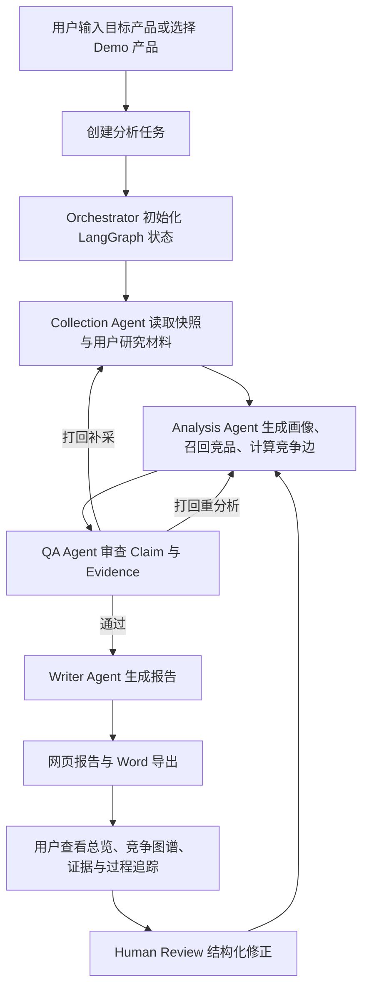
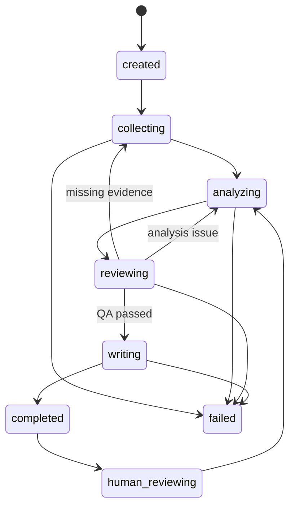

# 竞品分析与竞争关系重建多 Agent 协作系统产品设计文档

## 1. 文档信息

| 项目 | 内容 |
|---|---|
| 文档名称 | 竞品分析与竞争关系重建多 Agent 协作系统产品设计文档 |
| 文档版本 | v2.0 |
| 当前日期 | 2026-05-30 |
| 产品阶段 | 比赛 Demo 型 MVP，保留真实产品扩展点 |
| 核心技术方案 | FastAPI + LangGraph + React + TypeScript |
| MVP 数据策略 | 用户提供真实脱敏 SKU 快照为主，`snapshot_plus_live` 作为 Stage 1 已知公开 URL 增强模式：只访问任务输入和快照已有公开 URL，失败自动降级，不搜索新竞品 |
| 报告输出 | 前端网页报告 + 后端 Word `.docx` 导出 + 浏览器打印/另存 PDF |
| 路径约定 | 本文档位于 `memory-bank/`；文中 `backend/`、`frontend/`、`data/`、`docs/`、`demo/` 等路径均相对于项目根目录 |

## 2. 产品定位

本系统是一个面向电商实物产品的 AI 驱动多 Agent 竞品分析协作系统。它不只生成静态竞品报告，而是围绕目标产品，组织 Collection、Analysis、QA、Writer 四类 Agent 协作，基于结构化 Schema、证据链、QA 打回和人工修正，重建不同上下文切片下的竞争关系。

MVP 聚焦智能宠物硬件中的自动猫砂盆子类，使用用户提供的真实脱敏抖音电商 SKU 快照和补充用户研究材料，完成可稳定答辩演示的端到端链路。

## 3. 设计目标

### 3.1 产品目标

1. 帮助用户从目标产品出发，快速得到结构化的竞品画像、竞争关系和可执行建议。
2. 让每条核心结论可追溯到 Evidence，降低 AI 竞品分析的幻觉风险。
3. 通过 QA Agent 的真实打回机制，让分析过程具备可审查、可修正、可解释能力。
4. 通过竞争态势总览把关键判断、决策可用状态、首要行动和风险提示前置。
5. 通过竞争关系拨盘展示不同价格带、人群、场景下竞品关系的变化。
6. 通过证据与过程追踪页展示多 Agent 协作过程，支撑比赛答辩。

### 3.2 MVP 成功标准

1. 用户可以创建一个自动猫砂盆分析任务。
2. 系统可以基于本地快照跑通完整 LangGraph DAG。
3. 至少输出 8 到 12 个 SKU 的结构化竞品信息。
4. 每条核心 Claim 绑定 Evidence 和置信度。
5. QA Agent 至少触发一次真实打回，并改变任务状态和最终输出。
6. 前端可以展示输入页、竞争态势总览页、产品画像页、竞争图谱页、报告页、证据与过程追踪页。
7. 后端可以导出真实 Word `.docx` 报告，网页报告可通过浏览器打印或另存 PDF。

## 4. 用户与核心场景

### 4.1 目标用户

| 用户 | 诉求 |
|---|---|
| 产品经理 | 快速理解目标产品所处竞争环境，找到差异化机会 |
| 电商运营 | 识别价格带、卖点、评论痛点和转化阻碍 |
| 创业团队/参赛团队 | 用可演示、可追溯的方式展示 AI 竞品分析能力 |
| 研究人员 | 导入问卷/访谈文本，提炼人群、场景和决策因素 |

### 4.2 核心使用场景

用户输入一个自动猫砂盆产品信息或选择预置 Demo 产品，系统启动分析任务。Orchestrator 调度 Collection Agent 读取 SKU 快照、评论快照和用户研究材料，Analysis Agent 建模产品画像和竞争关系，QA Agent 检查证据完整性并触发必要打回，Writer Agent 生成结构化网页报告。用户创建任务后默认进入竞争态势总览，可以继续查看竞争关系图、切换动态切片、查看证据和 QA 打回记录、导出 Word 报告，并对关键结构化字段进行人工修正。

## 5. MVP 范围

### 5.1 包含范围

| 模块 | MVP 能力 |
|---|---|
| 任务创建 | 输入目标产品信息、选择行业/对象类型、选择数据范围 |
| 数据输入 | 本地 SKU 快照、评论快照、问卷/访谈文本导入 |
| Agent 编排 | 使用 LangGraph 定义真实 DAG 和条件打回边 |
| 竞品召回 | 同类相似召回、需求替代召回、内容共现召回 |
| 竞争评分 | 使用可解释规则计算 CompetitionEdgeScore |
| QA 审查 | 检查缺证据、缺字段、推断未标注、敏感表达等问题 |
| 人工修正 | 修正产品画像、竞品集合、切片、Claim 采纳状态和 Evidence 备注 |
| 证据与过程追踪 | 展示 Agent 运行、工具调用、Token、证据链、质检记录、打回记录和前后差异 |
| 报告输出 | 网页报告展示，后端导出 Word `.docx`，浏览器打印或另存 PDF |

### 5.2 暂不包含范围

| 能力 | 原因 |
|---|---|
| 多平台实时采集 | 20 天开发周期内稳定性风险高 |
| 大规模任务并发 | MVP 以单任务演示为主 |
| 自动触达真实用户 | 涉及调研合规和外部渠道 |
| 服务端 PDF 导出 | 浏览器打印或另存 PDF 足够支撑答辩，MVP 不新增 PDF 服务 |
| 正式 Markdown 交付 | 2.0 正式交付改为网页报告与 Word `.docx`，Markdown 不作为用户入口 |
| 跨行业深度迁移 | 第一版聚焦自动猫砂盆 |
| 复杂预测模型 | 可解释规则更适合 MVP 和答辩 |

## 6. 产品流程



## 7. 信息架构

前端 2.0 包含输入页和 5 个核心工作台页面。创建任务后默认进入“竞争态势总览”，过程追踪不再作为默认落点，但保留为证据、质检和系统能力追溯入口。

| 页面 | 主要用途 | 核心组件 |
|---|---|---|
| 输入页 | 创建任务并确认数据范围 | 产品输入区、Demo 数据选择、模型/数据提示、启动按钮 |
| 竞争态势总览页 | 先给 PM 可读的本次分析结论和行动判断 | 一句话判断、决策可用状态、关键竞品、机会风险、首要行动、分析范围 |
| 产品与竞品画像页 | 查看和修正目标产品及核心竞品结构化画像 | 基础信息、横向对比、功能能力树、价格与证据、人群画像、人工修正入口 |
| 竞争图谱页 | 展示动态竞争关系和关键竞品解释 | 竞争关系图、切片拨盘、决策链、四段式解释、证据卡片、QA 记录 |
| 分析报告页 | 展示最终分析报告并交付 Word | 2.0 八章节、静态图谱摘要、Word 下载、浏览器打印和打印视图 |
| 证据与过程追踪页 | 展示证据链、质检、DAG 和差异记录 | 证据链、质检记录、智能体过程、差异记录、技术详情折叠 |

## 8. 关键页面设计

### 8.1 输入页

#### 页面目标

让用户快速启动一次分析任务，同时明确本次任务使用的数据范围和模型范围。

#### 输入项

| 字段 | 类型 | 必填 | 说明 |
|---|---|---:|---|
| target_product_url | 文本 | 是 | 商品链接，用于匹配本地脱敏 SKU 快照并确定分析目标 |
| target_product_name | 文本 | 否 | 目标产品名称，可作为补充说明；命中快照后以后端快照名称为准 |
| category | 下拉 | 是 | 默认智能宠物硬件 |
| subcategory | 下拉 | 是 | 默认自动猫砂盆 |
| data_source_mode | 单选 | 是 | demo_snapshot / snapshot_plus_live |
| research_text | 文本/文件 | 否 | 问卷或访谈文本 |

#### 交互规则

1. 默认选择 `demo_snapshot`，保证演示稳定。
2. 商品链接为必填项，产品名称为选填项；系统优先用链接匹配本地快照 SKU，名称只作为补充兜底。
3. 当用户选择 `snapshot_plus_live` 时，提示系统只访问任务输入和本地快照已有的公开 URL，不绕过登录或验证码，不搜索新竞品；公开页面采集可能失败，失败后自动降级到本地快照。
4. 点击启动后创建 `AnalysisTask`，进入任务运行状态。

### 8.2 竞争态势总览页

#### 页面目标

把本次分析的“能不能用、先看谁、下一步做什么”放在第一屏，避免用户先进入技术过程页。

#### 展示内容

| 模块 | 内容 |
|---|---|
| 一句话判断 | 当前目标产品与核心竞品关系的 PM 可读结论 |
| 决策可用状态 | 可直接采纳、谨慎参考或证据不足，并展示原因 |
| 关键竞品 | 直接竞品、替代竞品、最高威胁对象和缺少参照时的说明 |
| 机会与风险 | 机会点、证据风险、需要人工复核的事项 |
| 首要行动建议 | 当前迭代最应该处理的内容、产品或证据动作 |
| 分析范围 | SKU 数、证据数、切片范围、数据来源和局限性 |

#### 交互规则

1. 创建任务后默认跳转到 `/overview?task_id=<task_id>`。
2. 总览页只消费 `GET /tasks/{task_id}/overview`，不由前端拼接旧接口数据。
3. 所有关键判断必须带 evidence、trace 或 missing reference 说明。

### 8.3 产品与竞品画像页

#### 页面目标

展示系统对目标产品的结构化理解，并允许用户进行有限人工修正。

#### 展示内容

| 模块 | 内容 |
|---|---|
| 基础信息 | 品牌、店铺、SKU 名称、价格、访问时间 |
| 目标产品与核心竞品对比 | 目标产品、最高威胁直接竞品、最高威胁替代竞品的横向对比 |
| 功能能力树 | 清洁能力、除臭能力、安全能力、智能能力、维护成本 |
| 价格与证据 | 标价、到手价、优惠、套餐、价格证据 |
| 用户人群画像 | 目标人群、痛点、使用场景、决策因素 |
| 证据摘要 | 商品页、评论、截图、调研材料 |

#### 人工修正范围

Human Review 第一版只允许修正结构化字段，不直接自由改写整份报告：

1. 目标产品画像字段，例如价格带、卖点、人群、场景。
2. 竞品集合，例如新增、移除、标记某 SKU 不参与评分。
3. 动态切片配置，例如价格带、人群、使用场景。
4. 单条 Claim 的采纳状态，例如采纳、暂不采纳、需复核。
5. Evidence 备注，例如补充来源局限性或人工确认说明。
6. 报告页结构化分析对象，例如 Battlecard 的我方回应/证据边界、GapMatrix 的差距类型/责任方向、Opportunity 的优先级/验收信号。

所有人工修正写入 `HumanFeedback`，并触发 Analysis Agent 局部重算。

### 8.4 竞争图谱页

#### 页面目标

让评委和用户一眼看到：当前切片下谁是核心竞品，为什么变强，目标产品输在哪个决策阶段，以及证据是否可信。

#### 核心组件

| 组件 | 说明 |
|---|---|
| 切片拨盘 | 切换价格带、用户人群、使用场景 |
| 竞争关系图 | 节点为产品或替代方案，边为 CompetitionEdge |
| 决策链 | 展示信息触达、兴趣形成、能力理解、信任建立、决策完成 |
| 四段式解释面板 | 展示为什么入选、关系类型、决策链影响和证据可信状态 |
| 证据卡片 | 展示 Evidence 来源、访问时间、截图、可信度和局限性 |
| QA 打回记录 | 展示是否发生打回、原因、处理结果和前后差异 |

#### 竞争关系展示规则

1. 默认展示当前切片下得分最高的直接竞品和替代竞品。
2. 切换切片后，竞争关系图和评分解释同步更新。
3. 每条竞争关系边必须展示至少一个 Claim 和对应 Evidence。
4. 缺证据或被 QA 标记的问题边需要显示风险状态。

### 8.5 分析报告页

#### 页面目标

提供可阅读、可汇报、可导出的竞品分析报告。

#### 报告结构

网页报告和 Word 报告优先渲染 `narrative_report.sections` 的 12 个正式章节；历史 `ReportData` 八章节仍作为兼容外壳和结构化数据来源保留，不作为用户优先阅读目录。

正式章节顺序如下：

1. 报告信息：标题、目标产品、数据范围、生成时间和风险声明。
2. 执行摘要：一句话结论、最大威胁、最大机会、首要动作和证据等级。
3. 研究问题与分析范围：说明本轮分析要回答的问题、数据范围和竞品选择口径。
4. 类目与市场背景：只基于规则和已有证据说明自动猫砂盆类目矛盾，不补写市场规模或实时排名。
5. 竞品选择与分层：说明核心竞品、替代竞品、低价威胁或高端标杆的入选理由。
6. 竞争格局判断：展开最重要价格带、人群和场景下的竞争地图，不罗列全量 SKU。
7. 核心竞品 Battlecard：说明为什么用户会比较、竞品强项、我方回应和风险边界。
8. 用户决策链分析：覆盖信息触达、兴趣形成、能力理解、信任建立、下单决策。
9. 差距矩阵：展示目标产品相对核心竞品的功能、证据、表达和转化差距。
10. 机会地图与优先级：输出 P0/P1/P2 动作、责任方向、预期影响和所需证据。
11. 风险与证据边界：区分可采纳结论、推断结论、暂无可靠数据和建议复核事项。
12. 附录：Evidence 索引、QA 打回、Trace 摘要和数据范围。

兼容的八章节外壳如下：

1. 执行摘要：一句话结论、最大威胁、最大机会、首要动作和证据等级。
2. 竞争格局：只展开最重要价格带、人群和场景下的竞争地图，不罗列全量 SKU。
3. 核心竞品 Battlecard：说明为什么用户会比较、竞品强项、我方回应和风险边界。
4. 用户决策链：说明用户从兴趣到下单在哪些环节被竞品影响。
5. 差距矩阵：展示目标产品相对核心竞品的功能、证据、表达和转化差距。
6. 机会地图与优先级：输出 P0/P1/P2 动作、责任方向、预期影响和所需证据。
7. 风险与证据边界：区分可采纳结论、推断结论、暂无可靠数据和建议复核事项。
8. 附录：Evidence 索引、QA 打回、Trace 摘要和数据范围。

#### 正文去重与智能分析验收

1. 正文不重复展示 SKU 基础字段；价格、销量、评分等事实只在影响判断时出现，其余放入附录。
2. 同一 `content_summary` 在同一正文章节最多展开一次，跨正文章节不应反复搬运。
3. 每个正文 item 必须回答“所以呢”：至少包含影响、含义或行动建议之一。
4. 每条行动建议必须包含动作、责任方向、优先级和证据边界；不能只写“建议关注”。
5. 每个核心竞品必须有 Battlecard，而不是只展示 SKU 字段列表。
6. 至少输出一张 GapMatrix，展示目标产品相对核心竞品的差距。
7. 至少输出 3 条 Opportunity，带优先级、预期影响、证据边界。
8. 所有事实判断仍必须绑定 Evidence 或 Claim；推断必须显式标记；证据不足写“暂无可靠数据”或“建议复核”。
9. 正文不得暴露 `task_id`、`edge_id`、`claim_id`、`evidence_id`、`product_id` 等内部字段；完整审计信息只进入附录、Trace 或证据页。
10. 未配置模型 API Key 时，规则流程仍必须生成完整报告。
11. 报告页 Human Review 只能通过受控字段入口修正 Battlecard、GapMatrix 和 Opportunity，不允许自由改写整份报告正文。

#### 导出规则

1. 前端提供“下载 Word 报告”“打印或另存 PDF”“切换打印视图”三个正式交付入口。
2. 后端 `GET /tasks/{task_id}/report/docx` 返回真实 Word `.docx` 文件。
3. Word 报告包含封面、目录、产品图片摘要、简化竞争关系图、正文和附录。
4. 网页报告和 Word 报告均保留 Claim、Evidence、置信度、访问时间和推断标识。
5. 不导出 API Key、完整系统 Prompt、未脱敏用户隐私信息。
6. 前端不展示 Markdown 导出入口，旧 Markdown 路由保持不可用。

### 8.6 证据与过程追踪页

#### 页面目标

证明系统不是黑盒报告生成器，而是有多 Agent 协作、结构化状态、工具调用和真实 QA 打回。

#### 展示内容

| 模块 | 内容 |
|---|---|
| DAG 状态 | LangGraph 节点、边、当前状态、打回路径 |
| 证据链 | 按 Claim 组织 Evidence、来源、访问时间状态、局限性和下钻入口 |
| 质检记录 | 检查项、问题等级、打回目标、处理要求、处理结果和是否仍需关注 |
| 智能体过程 | DAG 状态、Agent 运行、工具调用、模型用量和 Prompt 摘要 |
| 差异记录 | 打回或人工修正前后的结构化变化和业务影响 |

Prompt、错误、Diff 和嵌套字段默认折叠或脱敏展示，不暴露原始密钥、账号、手机号、地址或过长用户文本。

## 9. Agent 设计

### 9.1 Agent 列表

| Agent | 职责 | 输入 | 输出 |
|---|---|---|---|
| Orchestrator | 初始化任务、维护状态、调度 LangGraph | AnalysisTask | TaskState、AgentMessage |
| Collection Agent | 读取快照、整理商品和评论证据、处理用户研究材料 | TaskState、输入数据 | Evidence、Product、ReviewInsight |
| Analysis Agent | 生成产品画像、召回竞品、计算竞争关系 | Product、Evidence、HumanFeedback | FeatureTree、PricingModel、UserPersona、CompetitionEdge |
| QA Agent | 审查字段完整性、证据覆盖、推断标注和敏感表达 | Claim、Evidence、CompetitionEdge | ReviewTask、revision_request |
| Writer Agent | 生成网页报告结构化数据 | 通过 QA 的结构化产物 | ReportData |

### 9.2 LangGraph 状态流转



### 9.3 AgentMessage 协议

Agent 之间不传纯自然语言结论，必须使用结构化 `AgentMessage`。

```json
{
  "message_id": "msg_001",
  "task_id": "task_001",
  "from_agent": "qa_agent",
  "to_agent": "collection_agent",
  "message_type": "revision_request",
  "artifact_type": "claim_evidence_check",
  "payload": {
    "claim_id": "claim_018",
    "missing_fields": ["source_url", "access_time", "screenshot_path"],
    "reason": "价格结论缺少当前来源、访问时间和截图",
    "required_action": "补采价格页面证据；如果无法补采，则将价格优势结论改为暂无可靠数据"
  },
  "evidence_ids": [],
  "status": "requires_revision",
  "created_at": "2026-05-22T10:00:00+08:00"
}
```

## 10. QA 打回设计

### 10.1 QA 检查规则

| 检查项 | 规则 | 失败处理 |
|---|---|---|
| 证据完整性 | 核心 Claim 必须绑定 evidence_ids | 打回 Analysis Agent 或 Collection Agent |
| 时效字段 | 价格、评分、评价数、排名必须有 access_time | 打回 Collection Agent |
| 截图证据 | 关键价格或认证信息应有截图路径 | 打回 Collection Agent |
| 推断标注 | 推断内容必须 `is_inference=true` | 打回 Analysis Agent |
| 敏感表达 | 宠物安全、电器安全、医疗美容功效表达必须保守 | 打回 Writer 或 Analysis Agent |
| 评论聚类 | 不允许放大单条评论 | 打回 Analysis Agent |
| 前后矛盾 | 同一产品价格带、人群、卖点不能互相冲突 | 打回 Analysis Agent |

### 10.2 MVP 必备打回案例

演示中固定保留一个可复现案例：

1. Collection Agent 读取某竞品价格字段，但缺少 `access_time` 或 `screenshot_path`。
2. Analysis Agent 生成 Claim：该竞品在当前价格带具备明显价格优势。
3. QA Agent 检查发现价格属于时效信息，证据字段不完整。
4. QA Agent 发送 `revision_request` 给 Collection Agent。
5. Collection Agent 补充快照证据；如补充失败，则标记“暂无可靠数据”。
6. Analysis Agent 重新计算 `CompetitionEdgeScore`。
7. Writer Agent 更新报告。
8. 证据与过程追踪页展示打回前后差异。

## 11. 竞争关系评分设计

### 11.1 评分公式

```text
edge_score =
0.30 * demand_substitutability
+ 0.25 * context_match
+ 0.20 * decision_stage_impact
+ 0.15 * evidence_confidence
+ 0.10 * market_signal_strength
```

### 11.2 评分维度

| 维度 | 含义 | 示例 |
|---|---|---|
| demand_substitutability | 是否解决同一用户任务 | 自动猫砂盆与封闭猫砂盆都解决清理负担 |
| context_match | 是否匹配当前切片 | 多猫家庭、低预算、除臭场景 |
| decision_stage_impact | 是否影响关键购买阶段 | 信任建立阶段的安全认证 |
| evidence_confidence | 证据是否可靠完整 | 有 URL、截图、访问时间、评论聚类 |
| market_signal_strength | 市场信号强弱 | 评论量、评分、内容共现、销量趋势 |

### 11.3 决策链映射

每条 `CompetitionEdge` 至少绑定一个决策阶段：

1. 信息触达
2. 兴趣形成
3. 能力理解
4. 信任建立
5. 决策完成

## 12. 核心数据模型

### 12.1 AnalysisTask

```json
{
  "task_id": "task_001",
  "target_product_name": "Demo 自动猫砂盆",
  "category": "智能宠物硬件",
  "subcategory": "自动猫砂盆",
  "data_source_mode": "demo_snapshot",
  "status": "reviewing",
  "created_at": "2026-05-22T10:00:00+08:00",
  "updated_at": "2026-05-22T10:05:00+08:00"
}
```

### 12.2 Evidence

```json
{
  "evidence_id": "ev_001",
  "task_id": "task_001",
  "source_type": "douyin_sku_snapshot",
  "source_url": "https://example.com/product",
  "screenshot_path": "<project-root>/data/screenshots/sku_001.png",
  "access_time": "2026-05-22T09:30:00+08:00",
  "content_summary": "商品页显示到手价、核心卖点和用户评价数量",
  "confidence_level": "medium",
  "limitations": "来源为本地快照，非实时页面"
}
```

### 12.3 Claim

```json
{
  "claim_id": "claim_001",
  "task_id": "task_001",
  "claim_type": "pricing_advantage",
  "content": "竞品 A 在 1500 元以下价格带具备更强价格吸引力",
  "evidence_ids": ["ev_001", "ev_002"],
  "confidence": 0.78,
  "is_inference": false,
  "risk_flags": []
}
```

### 12.4 CompetitionEdge

```json
{
  "edge_id": "edge_001",
  "task_id": "task_001",
  "target_product_id": "prod_target",
  "competitor_product_id": "prod_a",
  "competition_type": "direct",
  "slice": {
    "price_band": "1000-1500",
    "persona": "多猫家庭",
    "scenario": "重除臭"
  },
  "decision_stages": ["能力理解", "决策完成"],
  "edge_score": 0.82,
  "score_breakdown": {
    "demand_substitutability": 0.9,
    "context_match": 0.85,
    "decision_stage_impact": 0.75,
    "evidence_confidence": 0.7,
    "market_signal_strength": 0.75
  },
  "claim_ids": ["claim_001"],
  "human_adjusted": false
}
```

### 12.5 HumanFeedback

```json
{
  "feedback_id": "hf_001",
  "task_id": "task_001",
  "target_type": "claim",
  "target_id": "claim_001",
  "action": "mark_needs_review",
  "before_value": {
    "status": "accepted"
  },
  "after_value": {
    "status": "needs_review"
  },
  "reason": "价格证据来自旧快照，需要复核",
  "created_at": "2026-05-22T10:20:00+08:00"
}
```

## 13. API 设计

### 13.1 任务接口

| 方法 | 路径 | 用途 |
|---|---|---|
| POST | `/tasks` | 创建分析任务 |
| GET | `/tasks/{task_id}` | 获取任务状态 |
| GET | `/tasks/{task_id}/overview` | 获取竞争态势总览 |
| GET | `/tasks/{task_id}/profile` | 获取产品画像 |
| GET | `/tasks/{task_id}/battlefield` | 获取竞争图谱数据 |
| GET | `/tasks/{task_id}/trace` | 获取过程追踪数据 |
| GET | `/tasks/{task_id}/report` | 获取网页报告数据 |
| GET | `/tasks/{task_id}/report/docx` | 导出 Word `.docx` 报告 |
| POST | `/tasks/{task_id}/feedback` | 提交人工修正 |

### 13.2 创建任务请求

```json
{
  "target_product_name": "Demo 自动猫砂盆",
  "target_product_url": "",
  "category": "智能宠物硬件",
  "subcategory": "自动猫砂盆",
  "data_source_mode": "demo_snapshot",
  "research_text": "访谈文本或问卷摘要"
}
```

### 13.3 人工修正请求

```json
{
  "target_type": "claim",
  "target_id": "claim_001",
  "action": "mark_rejected",
  "after_value": {
    "status": "rejected"
  },
  "reason": "该结论证据不足，不纳入最终报告"
}
```

## 14. 数据与存储设计

### 14.1 存储组成

| 存储 | 用途 |
|---|---|
| SQLite | 任务表、Artifact JSON、日志、反馈记录 |
| JSON 文件 | SKU 快照、评论快照、前端开发 fixture |
| 本地文件目录 | 截图、导出的 Word 报告、简化关系图 |
| `.env` | 模型 Key、Endpoint、模型名 |

### 14.2 建议目录

```text
backend/
  app/
    api/
    agents/
    graph/
    schemas/
    services/
    storage/
  tests/
frontend/
  src/
    pages/
    components/
    api/
    types/
data/
  snapshots/
  raw/
  reports/
  mock_task.json
  mock_trace.json
docs/
  api-contract.md
  schema.md
  agent-message-protocol.md
demo/
  script.md
  assets/
memory-bank/
  design-document.md
  tech-stack.md
  implementation-plan.md
  progress.md
  architecture.md
```

## 15. 模型与提示词策略

1. 默认接入比赛提供的 Doubao-Seed-2.0-lite。
2. 使用 OpenAI-compatible client 做模型适配；模型调用是可选增强，未配置 API Key 时必须仍能依靠本地快照和规则流程跑通 Demo。
3. 所有 Agent 输出优先要求 JSON Schema。
4. 关键结构化字段使用 Pydantic 校验。
5. Prompt 中明确禁止凭记忆补价格、尺寸、认证、排名等事实字段。
6. Prompt 展示到证据与过程追踪页前需要脱敏，隐藏 API Key、用户隐私和过长原文。

## 16. 异常与降级

| 异常 | 处理方式 |
|---|---|
| 实时采集失败 | 自动使用本地快照 |
| 模型返回非 JSON | 重试一次；仍失败则记录错误并使用兜底结构 |
| Evidence 缺失 | QA 打回；无法补充则写“暂无可靠数据” |
| Token 超限 | 对网页、评论、访谈文本先分片摘要 |
| 单个 Agent 失败 | 任务状态置为 partial_failed，并允许 Trace 展示失败节点 |
| Word 导出失败 | 保留网页报告，提示导出失败原因，并在 Trace 元信息中记录脱敏失败记录 |

## 17. 合规与隐私

1. 只使用公开页面或本地脱敏快照，不绕过登录、验证码、风控或付费墙。
2. 问卷和访谈文本默认脱敏，手机号、地址、账号 ID 不进入报告。
3. API Key、Endpoint Secret 不写入代码、文档、日志或截图。
4. 报告中对宠物安全、电器安全、认证、医疗美容等敏感表达保持保守。
5. 联盟评测站、单条评论、非权威内容只能作为方向参考，不写成权威结论。

## 18. 验收标准

### 18.1 功能验收

| 编号 | 标准 |
|---|---|
| A1 | 用户可以创建自动猫砂盆分析任务 |
| A2 | LangGraph DAG 可以跑通 Collection、Analysis、QA、Writer |
| A3 | 至少 8 个 SKU 生成结构化 Product、Evidence、Claim |
| A4 | QA Agent 可以真实触发一次 revision_request |
| A5 | 打回后 Collection 或 Analysis 重新执行并更新结果 |
| A6 | 竞争图谱页可以切换价格带、人群、场景 |
| A7 | 每条核心 CompetitionEdge 展示评分解释和证据 |
| A8 | 证据与过程追踪页展示证据链、质检记录、DAG、工具调用、Token、打回记录 |
| A9 | 用户可以提交有限 HumanFeedback |
| A10 | 后端可以导出 Word `.docx` 报告 |

### 18.2 演示验收

1. 使用本地快照完成稳定录屏。
2. 现场可以局部演示总览、切片切换、证据查看、QA 打回记录和 Word 导出。
3. 答辩材料明确展示系统差异点：动态竞争关系评分、上下文切片、QA 真实打回、过程追踪。

## 19. 版本规划

### 19.1 MVP 版本

1. 自动猫砂盆单品类。
2. 抖音电商本地快照。
3. LangGraph 单任务链路。
4. 结构化网页报告和 Word `.docx` 导出。
5. QA 打回和过程追踪。

### 19.2 后续版本

1. 支持更多平台，例如天猫、京东、Amazon、TikTok Shop。
2. 支持更完整的实时采集和定时刷新。
3. 支持多任务并发和任务队列。
4. 支持跨品类配置化迁移。
5. 支持报告版本管理和团队协作。
6. 支持更丰富的用户研究数据源和统计分析。

## 20. 开发优先级

| 优先级 | 能力 |
|---|---|
| P0 | Schema、API 契约、LangGraph DAG、Mock 数据 |
| P0 | Collection、Analysis、QA、Writer 主链路 |
| P0 | QA 真实打回案例 |
| P0 | 竞争图谱页和证据与过程追踪页 |
| P1 | 产品画像页、报告页、Word 导出 |
| P1 | Human Review 有限修正 |
| P1 | Token、工具调用和错误日志 |
| P2 | 实时采集增强 |
| P2 | UI 动效和更多报告格式 |

## 21. 答辩叙事

演示时围绕一句话展开：

传统竞品分析停留在列出对象，本系统重建的是竞争关系；而且这套关系可以被评分、被追溯、被 QA 打回，也可以被人工修正。

建议演示顺序：

1. 输入目标自动猫砂盆产品并启动任务。
2. 展示竞争态势总览的一句话判断、关键竞品和首要行动。
3. 展示产品与竞品画像和 Evidence。
4. 进入竞争图谱页，切换价格带、人群、场景。
5. 展示某条 CompetitionEdge 的四段式解释和证据卡片。
6. 展示 QA 打回案例和打回前后差异。
7. 展示网页报告、Word 导出和证据与过程追踪。
8. 总结系统价值和可扩展方向。
