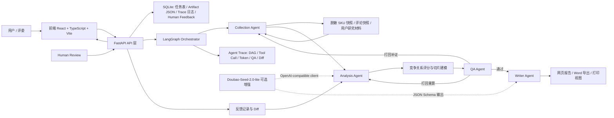

# 完赛项目提报材料

> 本文档用于比赛最终项目提报。带有“待补充”的字段需要在正式提交前替换为真实团队信息、Demo 链接、视频链接和仓库链接。

## 一、基础信息

| 字段 | 内容 |
|---|---|
| 项目名称/课题 | AI 驱动的竞品分析与竞争关系重建多 Agent 协作系统 |
| 参赛课题 | CIS - AI 驱动的竞品分析 Agent 协作系统 |
| 项目方向 | 自动猫砂盆类目的竞品分析、竞争关系重建与可追溯报告生成 |
| 团队名称 | 待补充 |
| 团队成员名单 | 待补充：姓名 / 学校 / 专业 / 角色 |
| 当前版本 | MVP 可用 Demo，已冻结稳定演示数据与 2.0 演示路径 |

### 分工说明

| 成员 | 角色 | 负责模块 |
|---|---|---|
| 待补充 | 队长 / 架构负责人 | 系统架构设计、LangGraph 多 Agent 编排、QA 打回闭环、部署与演示统筹 |
| 待补充 | AI / 后端工程师 | Collection、Analysis、QA、Writer Agent 开发，Schema 设计，证据链与报告生成 |
| 待补充 | 前端 / 全栈工程师 | React 前端页面、Trace 可视化、竞争图谱、Human Review、前后端联调 |
| 待补充 | 产品 / 数据负责人 | Demo 脱敏 SKU 快照整理、用户路径设计、答辩材料与演示视频 |

## 二、功能说明

### 核心功能清单

- 多角色 Agent 协作：通过 LangGraph 组织 Collection、Analysis、QA、Writer 四类 Agent，形成可运行的 DAG 流程。
- 结构化数据与证据链：使用本地脱敏 SKU 快照、评论洞察和用户研究材料生成 Product、Evidence、Claim、CompetitionEdge 等结构化 Artifact。
- 竞争关系重建：不只输出竞品列表，而是按价格带、人群、使用场景等切片重建目标产品与竞品之间的竞争边、威胁等级和决策解释。
- QA 真实打回闭环：QA Agent 对缺证据、缺访问时间、推断未标注、敏感表达等问题发起 revision request，并触发 Collection 补证或 Analysis 局部重算。
- Agent Trace 可观测：前端展示 DAG、Agent Run、Tool Call、Token Usage、Evidence Chain、QA 记录和打回前后 Diff。
- 报告与导出：提供网页报告、Word `.docx` 导出和浏览器打印视图；内部报告生成遵循证据优先和敏感信息脱敏规则。

### 端到端使用流程

1. 用户进入前端输入页，选择预置 Demo 自动猫砂盆产品，或填写目标产品、竞品范围和分析维度。
2. 系统创建分析任务，后端写入 SQLite，并启动本地后台任务执行 LangGraph 工作流。
3. Collection Agent 读取脱敏 SKU 快照、评论快照和用户研究材料，抽取商品、证据和评论洞察。
4. Analysis Agent 基于结构化证据生成目标产品画像、竞品画像、价格模型、人群模型和竞争关系评分。
5. QA Agent 检查 Claim 与 Evidence 绑定、时效字段、截图证据、推断标注和敏感表达；不合格时触发打回。
6. 打回后 Collection Agent 补齐缺失证据，Analysis Agent 对受影响 Claim 和 CompetitionEdge 局部重算，并记录 Diff。
7. Writer Agent 将通过 QA 的结构化产物生成网页报告和可导出的 Word 报告。
8. 用户在前端查看竞争态势总览、竞争图谱、产品画像、分析报告和证据追踪，并可通过 Human Review 对有限结构化字段进行人工修正。

## 三、交付材料

| 材料类型 | 链接 / 说明 |
|---|---|
| 在线 Demo 链接 | 待补充：如未部署公网 Demo，可填写演示视频链接或录屏链接替代 |
| 体验账号 | 待补充：如 Demo 无需登录，填写“无需登录” |
| 演示视频链接 | 待补充：建议 3-8 分钟，展示创建任务、QA 打回、Trace、竞争图谱、报告导出 |
| 源代码仓库链接 | 待补充：GitHub / GitLab 主仓库链接、分支说明、最后提交记录 |
| README / 运行说明 | 待补充根目录 `README.md`；当前本地启动说明见 `memory-bank/manual-runbook.md`，API 契约见 `docs/api-contract.md` |
| 稳定 Demo 输入 | `demo/stable-demo-input.json` |
| Demo 数据冻结说明 | `demo/DEMO_FREEZE.md` |
| API 契约文档 | `docs/api-contract.md` |

## 四、技术说明

### 系统架构图



### 核心技术栈

| 层级 | 技术选型 | 说明 |
|---|---|---|
| 前端 | React + TypeScript + Vite | 单页应用与开发构建 |
| UI 组件 | Ant Design + lucide-react | 表单、表格、标签、按钮、图标和工作台界面 |
| 数据请求 | TanStack Query | 任务状态轮询、接口缓存和错误状态管理 |
| 图谱展示 | React Flow | 展示竞争关系图、DAG 和节点边关系 |
| 后端 | Python 3.12 + FastAPI | API 服务、统一响应格式和任务入口 |
| Agent 编排 | LangGraph | 真实 DAG、条件边、QA 打回和局部重跑 |
| 数据模型 | Pydantic v2 | AgentMessage、Artifact、Claim、Evidence、Trace 等结构化 Schema |
| 数据库 | SQLite + SQLAlchemy | 轻量任务表、Artifact JSON、Trace 日志和人工反馈记录 |
| 大模型 | Doubao-Seed-2.0-lite via OpenAI-compatible client | 可选增强；未配置 API Key 时依靠本地快照和规则流程完整跑通 |
| 测试 | Pytest、httpx、Vitest、Testing Library、Playwright | 后端单测、API 测试、前端组件测试和端到端演示路径验证 |
| 质量工具 | Ruff、ESLint、Prettier | Python 与前端代码质量检查 |
| 部署 | 待补充 | 当前支持本地启动；公网部署地址和云资源需在提交前补充 |

### 大模型 / AI 能力使用说明

- Agent 编排：使用 LangGraph 定义 Orchestrator、Collection、Analysis、QA、Writer 的 DAG 节点和条件打回边。
- 结构化通信：Agent 之间使用 `AgentMessage` 和 Pydantic Schema 传递结构化数据，不依赖不可审计的纯自然语言中间结果。
- 模型增强：Doubao-Seed-2.0-lite 通过 OpenAI-compatible client 作为可选增强，用于分析表达、报告段落润色和结构化输出补强。
- 离线可运行：未配置模型 API Key 时，系统仍可基于本地脱敏快照、规则评分和 QA 规则完整跑通 Demo。
- 证据优先：所有 Claim 必须绑定 Evidence；缺少可靠证据时输出“暂无可靠数据”，推断内容必须显式标记为推断。
- 安全控制：Prompt 预览、Trace、报告和导出内容均不得暴露 API Key、Token、账号、手机号、地址或未脱敏用户数据。

### 关键工程难点与解决方案

| 难点 | 解决方案 |
|---|---|
| 多 Agent 状态传递容易变成黑盒 | 使用 LangGraph State 和 Pydantic Artifact 约束状态形状，所有 Agent 输出都进入任务 Artifact、AgentMessage 和 Trace 日志 |
| QA 打回后需要真实改变结果 | 固定可复现的 QA 缺证据案例，QA 发起 revision request 后由 Collection 补齐证据，再由 Analysis 局部重算受影响 Claim 和 CompetitionEdge |
| 脱敏快照既要可演示又不能伪造最终数据 | Demo 使用用户提供的真实脱敏 SKU 快照；测试 fixture 只用于开发验证，不作为最终演示数据 |
| Trace 信息丰富但有泄密风险 | 对 Trace、报告、导出元信息和错误响应做脱敏处理，只展示摘要、计数、证据链和必要 Diff，不展示密钥、原始长文本或敏感标识 |
| 前后端契约频繁变化 | 通过统一 API 契约、OpenAPI 类型同步、TanStack Query 轮询和页面级数据接口减少前端拼装逻辑 |
| Word 导出失败不能影响主报告 | 网页报告作为主交付入口，Word 导出失败时保留网页报告，并在 Trace 中记录脱敏后的诊断信息 |

### 部署与访问说明

当前项目支持本地稳定运行，公网部署信息需在正式提交前补充。

本地后端启动：

```powershell
cd D:\pythonproject\zijieagent\backend
.\.conda312\python.exe -m uvicorn app.main:app --host 127.0.0.1 --port 8000 --reload
```

本地前端启动：

```powershell
cd D:\pythonproject\zijieagent\frontend
npm run dev
```

访问地址：

```text
前端：http://127.0.0.1:5173
后端健康检查：http://127.0.0.1:8000/health
```

评委快速体验建议：

1. 使用在线 Demo 链接直接访问，或按演示视频观看完整流程。
2. 如需本地运行，按上述命令启动后端和前端。
3. 进入前端后使用默认 Demo 输入创建任务。
4. 查看竞争态势总览、竞争图谱、产品画像、分析报告和证据追踪页面。
5. 在 Trace 中重点查看 QA 打回、Collection 补证、Analysis 重算和 Diff 记录。

## 五、结果说明

### 项目完成度

当前状态：MVP 可用 Demo，已完成稳定演示路径冻结。

系统已完成端到端任务创建、多 Agent DAG、QA 真实打回、证据追踪、竞争关系图谱、网页报告、Word 导出和有限 Human Review。当前版本适合比赛评审体验和答辩演示，不宣称达到生产级在线采集平台能力。

### 项目亮点 / 创新点

| 亮点 | 说明 |
|---|---|
| 竞争关系重建而非简单列表 | 系统围绕价格带、人群、场景切片计算竞争边和威胁等级，帮助用户理解“谁在什么条件下构成竞争”。 |
| QA 真实打回闭环 | QA Agent 不只检查格式，而是能发现时效证据缺失，触发补证与局部重算，并在 Trace 中展示前后差异。 |
| 全链路可追溯与可人工修正 | Claim、Evidence、Agent Run、Tool Call、Token、QA 和 Human Review 都可追踪，人工修正会进入 Diff 并触发局部重算。 |

## 六、选填补充材料

| 材料类别 | 材料名称 | 说明 / 链接 |
|---|---|---|
| 产品材料 | 项目讲解 PPT | 待补充 |
| 产品材料 | 产品截图 | 待补充：建议包含输入页、总览页、竞争图谱、报告页、Trace 页 |
| 技术材料 | API 接口文档 | `docs/api-contract.md`；FastAPI OpenAPI 文档可在后端启动后访问 |
| 技术材料 | 数据库 ER 图 | 待补充：可基于 SQLite 任务表、Artifact 表、Trace 表、Human Feedback 表绘制 |
| AI 材料 | Agent 工作流说明 | `memory-bank/design-document.md`、`memory-bank/architecture.md` |
| AI 材料 | Prompt / 模型策略文档 | 待补充：可从模型可选增强、JSON Schema 输出、证据优先规则展开 |
| AI 材料 | 评测方案与样例 | `demo/DEMO_FREEZE.md`、`demo/stable-demo-input.json` |
| 业务材料 | 场景落地设想 | 待补充：电商选品、商品经理竞品监控、运营复盘、市场分析 |
| 过程材料 | 开发里程碑 | `memory-bank/progress.md`、`memory-bank/implementation-plan.md` |

## 七、合规声明

- Demo 数据来自用户提供的真实脱敏 SKU 快照，不包含真实 API Key、账号、手机号、地址或其他敏感个人信息。
- MVP 不进行真实外部实时采集，`snapshot_plus_live` 仅作为增强模式占位；正式演示依赖本地脱敏快照。
- `.env` 仅用于本地环境变量，不提交真实密钥，不在日志、Trace、截图或导出报告中展示密钥。
- 报告中涉及宠物安全、电器认证、医疗或美容功效等敏感表达时采用保守措辞。
- 找不到可靠证据时统一写“暂无可靠数据”，不凭记忆补充价格、认证、尺寸、销量或排名。
- 推断内容必须显式标记为推断，且不得覆盖结构化证据和 QA 结果。
- 工具、模型和数据使用需符合比赛工具与资源使用规范。

## 八、正式提交前检查清单

- [ ] 已补充团队名称、成员名单、学校、专业和角色。
- [ ] 已补充在线 Demo 链接，或提供可公开访问的演示视频链接。
- [ ] 已补充源代码仓库链接、分支说明和最后提交记录。
- [ ] 已补充根目录 `README.md` 或确认提报页引用的运行说明完整可用。
- [ ] 已确认 Demo 可在无模型 API Key 的情况下基于本地快照跑通。
- [ ] 已确认报告、Trace、截图和导出文件不含 API Key、Token、账号、手机号、地址等敏感信息。
- [ ] 已确认提交内容没有引入 Celery、Redis、PostgreSQL、Next.js、Redux、Tailwind、真实外部采集平台或微服务架构等 MVP 禁止项。
