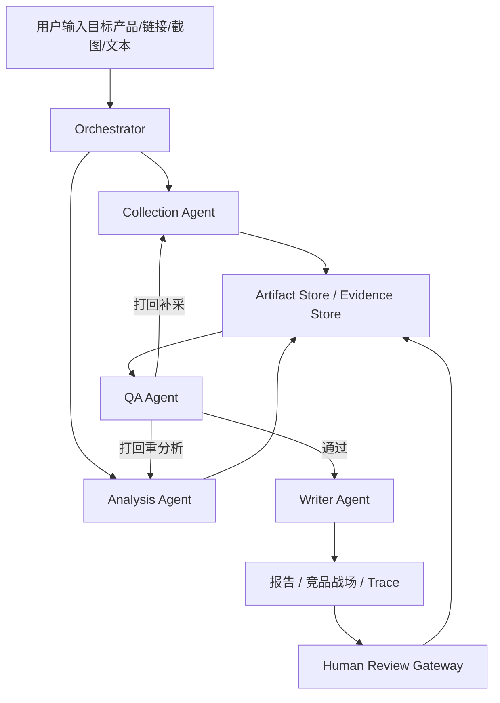

# 竞品分析 Agent 协作系统方案（队内执行版）

> 这份文档用于队内沟通和落地执行，优先服务 20 天开发、答辩演示和分工协作。  
> 不追求“大而全”，优先保证：多 Agent 真实协作、结构化 Schema、QA 打回闭环、证据可追溯、前端可演示。

---

## 1. 项目结论

### 1.1 一句话定位

我们做的不是普通竞品报告生成器，而是一个 **AI 驱动的多 Agent 竞品分析协作系统**。系统围绕一个目标产品，自动采集公开信息和用户研究材料，按统一 Schema 生成竞品知识，并通过 QA Agent 交叉审查与打回机制输出可追溯的竞品分析报告。

### 1.2 核心亮点

1. **多 Agent 协作**：采集、分析、撰写、质检 4 个主 Agent，外加 Orchestrator 和人工校正节点。
2. **结构化输出**：功能树、定价模型、用户画像、Claim、Evidence、CompetitionEdge 都走固定 Schema。
3. **真实反馈闭环**：QA Agent 能识别缺证据、缺字段、推断未标注等问题，并打回补采或重分析。
4. **信息溯源**：每条核心结论都能追到来源 URL、截图、评论聚类、问卷或访谈记录。
5. **动态竞争关系**：同一产品在不同价格带、人群、场景下，核心竞品和竞争理由会变化。
6. **可观测**：前端展示 Agent DAG、工具调用、输入输出、Token 消耗、QA 打回记录。

### 1.3 MVP 范围

第一版只做能稳定答辩的范围：

- 主场景：智能宠物硬件
- 主子类：自动猫砂盆
- 主平台：抖音电商单平台
- 数据规模：8 到 12 个 SKU 快照
- 用户研究：问卷/访谈提纲生成 + 已有问卷/访谈文本导入分析
- Agent：Collection / Analysis / Writer / QA 四个主 Agent
- 必做闭环：至少 1 个真实 QA 打回案例
- 必做前端：输入页、产品画像页、竞品战场页、报告页、Agent Trace 页

暂缓能力：

- 多平台实时采集
- 自动触达真实用户
- 大规模多任务并发
- 完整跨行业自动迁移
- 复杂预测模型

---

## 2. 官方评分对齐

| 官方评分维度 | 权重 | 我们必须展示什么 |
|---|---:|---|
| 多 Agent 协作与输出可信度 | 35% | 4 个主 Agent、LangGraph/CrewAI DAG、结构化消息、QA 打回、Schema 输出、证据链 |
| 技术深度与工程完整度 | 25% | 后端接口、前端交互、Agent Trace、Token 统计、异常重试、本地快照降级 |
| 业务价值与产品体验 | 20% | 竞品分析效率提升、结构化一致性、报告溯源、人工修正、竞争关系切换 |
| 代码质量与文档 | 10% | README、架构图、Agent 协议、Schema 文档、部署说明、Git 提交规范 |
| 合规、材料与答辩 | 10% | 公开数据合规、问卷访谈脱敏、API Key 不入库、演示视频和 PPT 完整 |

最小验收清单：

- 使用 LangGraph 或 CrewAI 明确定义 DAG。
- Agent 间传递结构化 `AgentMessage` 和 `Artifact`，不是纯自然语言接力。
- 实现 `FeatureTree`、`PricingModel`、`UserPersona`、`Claim`、`Evidence`、`CompetitionEdge`。
- 每条核心结论有证据来源。
- QA Agent 至少触发一次真实打回，并展示打回前后变化。
- 前端能看 Agent Trace：Prompt、输入、输出、工具调用、Token、打回记录。
- 代码和文档中不出现真实 API Key。

---

## 3. 系统架构

### 3.1 总体流程



### 3.2 Agent 职责

| 角色 | 职责 | 输出 |
|---|---|---|
| Orchestrator | 拆任务、生成 DAG、调度 Agent、管理状态 | `TaskState`、任务计划 |
| Collection Agent | 采集商品页、评论、内容线索；生成问卷/访谈提纲；处理已有问卷/访谈文本 | `Evidence`、`ReviewInsight`、`Survey/Interview` |
| Analysis Agent | 建模产品画像、召回竞品、生成切片、计算竞争关系分数 | `FeatureTree`、`PricingModel`、`UserPersona`、`CompetitionEdge` |
| QA Agent | 检查字段完整性、证据覆盖、推断标注、敏感表达、前后矛盾 | `ReviewTask`、打回原因、置信度 |
| Writer Agent | 生成结构化报告、结论摘要、建议和证据展示 | 报告数据、Markdown |
| Human Review | 人工修正目标画像、竞品集合、切片、问卷、关键结论 | `HumanFeedback` |

### 3.3 真实 QA 打回样例

答辩建议演示这个闭环：

1. Collection Agent 采集到某竞品价格，但没有记录访问时间或截图。
2. Analysis Agent 生成“该竞品价格优势明显”的结论。
3. QA Agent 发现价格属于时效信息，缺少 `access_time` 和 `screenshot_path`。
4. QA Agent 打回 Collection Agent。
5. Collection Agent 补采页面快照；如果找不到可靠来源，则写“暂无可靠数据”。
6. Analysis Agent 重新计算 `CompetitionEdgeScore`。
7. Writer Agent 更新报告。
8. 前端 Trace 展示打回前后差异。

这个案例很重要，可以证明反馈闭环不是伪装出来的。

---

## 4. 结构化协议与核心 Schema

### 4.1 AgentMessage

Agent 间统一使用结构化消息。

```json
{
  "message_id": "msg_001",
  "task_id": "task_001",
  "from_agent": "qa_agent",
  "to_agent": "collection_agent",
  "message_type": "revision_request",
  "artifact_type": "claim_evidence_check",
  "payload": {
    "claim_id": "claim_018",
    "missing_fields": ["source_url", "access_time"],
    "reason": "价格结论缺少当前来源和访问时间",
    "required_action": "补采价格页面证据或改为暂无可靠数据"
  },
  "evidence_ids": [],
  "status": "requires_revision",
  "created_at": "2026-05-22T10:00:00+08:00"
}
```

消息类型：

- `task_request`
- `artifact_submit`
- `review_request`
- `revision_request`
- `revision_submit`
- `human_override`
- `finalize_request`

### 4.2 核心 Schema

只保留第一版必须实现的实体：

| Schema | 用途 |
|---|---|
| `AnalysisTask` | 任务状态、输入类型、行业、对象类型 |
| `Product` | SKU 名称、品牌、店铺、价格、卖点、人群、场景 |
| `FeatureTree` | 官方要求的功能树，统一对齐竞品功能 |
| `PricingModel` | 官方要求的定价模型，记录标价、到手价、优惠、套餐、访问时间 |
| `UserPersona` | 官方要求的用户画像，记录痛点、决策因素、使用场景 |
| `Evidence` | 来源 URL、截图、访问时间、证据等级、局限性 |
| `Claim` | 分析结论，必须绑定证据和置信度 |
| `CompetitionEdge` | 目标产品与竞品之间的竞争关系边 |
| `CompetitionEdgeScore` | 竞争关系评分 |
| `ReviewTask` | QA 审查记录和打回原因 |
| `HumanFeedback` | 人工修正记录 |
| `AgentRunLog` | Agent 运行日志 |
| `ToolCallLog` | 工具调用日志 |
| `TokenUsageLog` | Token 消耗 |
| `DecisionTrace` | Agent 决策过程 |

### 4.3 CompetitionEdgeScore

第一版用可解释规则，不做复杂预测。

```text
edge_score =
0.30 * 需求替代性
+ 0.25 * 上下文匹配度
+ 0.20 * 决策阶段影响力
+ 0.15 * 证据置信度
+ 0.10 * 市场信号强度
```

每条竞争关系边必须说明：

- 为什么成立
- 在哪个切片下成立
- 影响哪个决策阶段
- 有哪些证据
- 是否经过人工修正

---

## 5. 分析逻辑

### 5.1 三路竞品召回

| 召回方式 | 说明 | 示例 |
|---|---|---|
| 同类相似召回 | 根据品类、标题关键词、价格带、参数、卖点召回直接竞品 | 自动猫砂盆 vs 自动猫砂盆 |
| 需求替代召回 | 根据用户任务和痛点召回替代方案 | 除臭猫砂、封闭猫砂盆、空气净化方案 |
| 内容共现召回 | 根据评论、短视频、搜索词、测评内容召回用户真实比较对象 | “静音”“除臭”“不卡猫”“多猫家庭” |

### 5.2 决策链

统一使用 5 个阶段：

1. 信息触达
2. 兴趣形成
3. 能力理解
4. 信任建立
5. 决策完成

每个竞品优势都要落到至少一个决策阶段，避免只写“谁更强”。

### 5.3 动态竞争切片

第一版只做三个切片：

- 价格带
- 用户人群
- 使用场景

每个切片回答四件事：

1. 当前最强直接竞品是谁
2. 当前最强替代竞品是谁
3. 目标产品输在哪个决策阶段
4. 优先调整什么

### 5.4 数据可信度规则

这些规则必须进入 QA Agent：

- 不凭记忆填写尺寸、价格、排名、认证、材料、承重等参数。
- 价格、评分、排名、评价数必须标注来源和访问时间。
- 找不到可靠数据时写“暂无可靠数据”。
- 推断性内容必须标注“推断”。
- 联盟评测站只能作为方向参考，不能写成权威结论。
- Amazon 差评、论坛反馈、电商评论要聚类，不能放大个别评论。
- 儿童、宠物、食品接触、电器、医疗、美容功效等敏感表达必须保守。

---

## 6. 前端页面

第一版做 5 个页面即可。

| 页面 | 必须展示 |
|---|---|
| 输入页 | 输入目标产品、行业/对象类型确认、任务启动、模型和数据范围提示 |
| 产品画像页 | 子类、价格带、卖点、人群、场景、人工修正入口 |
| 竞品战场页 | 竞争关系图、竞争关系拨盘、决策链、评分解释、证据卡片、QA 打回记录 |
| 报告页 | 产品画像、竞品发现、动态切片、用户研究、建议、证据追溯 |
| Agent Trace 页 | DAG 状态、Prompt、输入输出、工具调用、Token、打回前后对比 |

竞品战场页是主展示页。评委应该一眼看到：

- 当前切片是什么
- 核心竞品是谁
- 为什么竞品变强
- 目标产品输在哪个决策阶段
- 哪些证据支撑
- QA 是否打回过

---

## 7. 技术实现

### 7.1 技术栈

后端：

- Python
- FastAPI
- LangGraph 或 CrewAI
- Pydantic
- SQLite / PostgreSQL
- JSON 文件保存原始快照

前端：

- React
- TypeScript
- React Flow / AntV G6 / ECharts

模型层：

- 默认接入比赛提供的 Doubao-Seed-2.0-lite
- 使用 OpenAI-compatible client 封装
- API Key、Endpoint、模型名只放 `.env` 或部署环境变量
- 文档、代码、Git 历史中不写真实 Key

### 7.2 工程模块

- 输入解析模块
- Agent 编排模块
- Collection Agent
- Analysis Agent
- Writer Agent
- QA Agent
- Artifact Store / Evidence Store
- 竞品召回模块
- 竞争关系评分模块
- 用户研究处理模块
- Trace 日志模块
- Token 统计模块
- 前端可视化模块

### 7.3 幻觉抑制与错误恢复

- 超长网页、评论、访谈文本先分片摘要，再结构化抽取。
- 关键结论必须绑定 `evidence_ids`。
- 字段缺失时输出“暂无可靠数据”。
- 工具调用失败先重试，重试失败用本地快照降级。
- 现场演示优先使用稳定快照，实时抓取只做增强展示。
- 推断结论统一 `is_inference=true`，报告中显示“推断”。

### 7.4 合规与隐私

- 只采集公开页面，不绕过登录、验证码、风控或付费墙。
- 采集前检查目标站点公开页面、robots.txt 和服务条款。
- 问卷和访谈数据默认脱敏。
- 日志中对 API Key、手机号、地址、账号 ID 做脱敏。
- 演示数据使用公开样例或脱敏样例。

---

## 8. Demo 叙事

答辩主线：

1. 输入一个自动猫砂盆产品。
2. 系统识别产品画像：子类、价格带、卖点、人群、场景。
3. Collection Agent 采集商品页、评论、内容线索和用户研究材料。
4. Analysis Agent 召回直接竞品、替代竞品、错位竞品。
5. 打开竞品战场页，用竞争关系拨盘切换价格带、人群、场景。
6. 展示竞争关系评分：为什么某竞品在当前切片变成最强对手。
7. 展示一次真实 QA 打回：价格或认证缺少来源，打回补采或改为“暂无可靠数据”。
8. 打开 Agent Trace 页：Prompt、输入输出、工具调用、Token、打回记录。
9. 输出报告和可执行建议。
10. 最后强调：传统竞品分析停留在列对象，我们重建竞争关系，并且每条关系可追溯、可打回、可修正。

演示策略：

- 以录屏为主，保证稳定。
- 现场只做局部交互。
- 数据用本地快照兜底。
- 不依赖现场实时抓取成功。

---

## 9. 两人分工与 20 天排期

### 9.1 分工原则

两个人按“后端 Agent 主链路 / 前端展示与答辩材料”拆分。第 1 到 2 天共同定好 Schema、API 和 mock 数据，之后尽量并行开发。

### 9.2 成员 A：后端与 Agent 主链路

负责：

- FastAPI 接口
- LangGraph / CrewAI DAG
- Doubao 模型适配
- Pydantic Schema
- Collection / Analysis / Writer / QA Agent
- 三路竞品召回
- CompetitionEdgeScore
- Evidence / Artifact Store
- QA 打回闭环
- AgentRunLog / ToolCallLog / TokenUsageLog
- 异常处理和快照降级

主要目录：

- `backend/`
- `agents/`
- `schemas/`
- `data/`
- `tests/`

### 9.3 成员 B：前端展示与答辩材料

负责：

- React 前端
- 输入页、产品画像页、竞品战场页、报告页、Trace 页
- 竞争关系拨盘
- 评分解释面板
- 人工修正交互
- QA 打回前后对比
- mock 数据和接口联调
- README、PPT、演示脚本、录屏

主要目录：

- `frontend/`
- `docs/`
- `demo/`
- `assets/`

### 9.4 共同接口契约

第 1 到 2 天必须定好：

- `docs/api-contract.md`
- `docs/schema.md`
- `docs/agent-message-protocol.md`
- `data/mock_task.json`
- `data/mock_trace.json`

第一版接口：

- `POST /tasks`
- `GET /tasks/{id}`
- `GET /tasks/{id}/profile`
- `GET /tasks/{id}/battlefield`
- `GET /tasks/{id}/trace`
- `POST /tasks/{id}/feedback`
- `GET /tasks/{id}/report`

接口确定后，前端用 mock 数据开发，后端按 mock 数据输出真实接口。

### 9.5 20 天排期

| 时间 | 成员 A | 成员 B | 目标 |
|---|---|---|---|
| 第 1-2 天 | 初始化后端、定 Schema、空接口、AgentMessage | 初始化前端、画线框、准备 mock JSON | 契约固定 |
| 第 3-6 天 | 接模型、搭 DAG、4 Agent 空流程、准备 SKU 快照 | 前端基础布局、产品画像、竞争关系图、报告页 | 前后端各自能跑 |
| 第 7-10 天 | 三路召回、竞争关系评分、Claim+Evidence、QA 检查 | 竞争关系拨盘、评分解释、人工修正、Trace 初版 | 核心能力成型 |
| 第 11-14 天 | 真实任务流、QA 打回案例、日志和 Token 记录 | 接真实接口、展示打回前后、优化主页面 | 跑通完整闭环 |
| 第 15-17 天 | 异常处理、快照降级、后端 README、接口文档 | UI 打磨、演示脚本、PPT、第一版录屏 | 演示稳定 |
| 第 18-20 天 | 修 bug、检查脱敏和 Key、准备技术问答 | 最终视频、提交材料、PPT 演练 | 冻结交付 |

协作规则：

- 第 2 天后 Schema 和 API 不随意大改。
- 接口变更先改文档和 mock，再改代码。
- 每天同步 15 分钟：昨天完成、今天目标、接口变化、阻塞点。
- 第 15 天后不加大功能，只修稳定性和表达。

---

## 10. 20 天内必须保住的能力

优先级从高到低：

1. 4 个主 Agent 能跑通。
2. LangGraph / CrewAI DAG 可视化。
3. 结构化 Schema 输出。
4. QA 真实打回闭环。
5. Claim + Evidence 溯源。
6. Agent Trace 可观测。
7. 竞争关系拨盘。
8. Markdown 报告输出。
9. 人工修正入口。
10. 稳定录屏和答辩 PPT。

可以砍掉：

- 多平台实时采集
- 自动触达用户
- PDF 导出
- 多任务并发
- 第二品类深度分析
- 完整互联网产品 mini case

---

## 11. 风险与应对

| 风险 | 表现 | 应对 |
|---|---|---|
| 范围过大 | 想同时做多平台、多品类、多任务 | 只做自动猫砂盆 + 抖音快照 |
| 数据采集不稳 | 现场抓取失败 | 本地快照兜底，录屏为主 |
| 闭环像假的 | QA 只写在文档里，不真实打回 | 准备一个可演示打回案例 |
| 输出像黑盒 | 只有报告，没有过程 | 做 Agent Trace 页 |
| 关系切片像分组 | 只是按价格/人群分类 | 展示竞品切换和评分变化 |
| 数据不可信 | 参数没来源，评论被放大 | QA 强制检查来源、访问时间、聚类和推断标注 |
| API Key 泄露 | Key 写入代码或截图 | 只用 `.env`，提交前检查 |
| 答辩不稳定 | 现场依赖实时模型和抓取 | 录屏 + 快照 + 局部现场交互 |

---

## 12. 参考仓库

这些仓库只作为模块参考，不直接照搬。

| 仓库 | 参考价值 |
|---|---|
| [brightdata/competitive-intelligence](https://github.com/brightdata/competitive-intelligence) | 竞品情报系统形态、Agent 分工、任务进度展示 |
| [tarun7r/deep-research-agent](https://github.com/tarun7r/deep-research-agent) | 深度研究、证据引用、可信度和质量校验 |
| [nexscope-ai/eCommerce-Skills](https://github.com/nexscope-ai/eCommerce-Skills) | 电商竞品、价格、评论、TikTok Shop 分析任务拆法 |
| [apify/agent-skills](https://github.com/apify/agent-skills) | 多平台采集工具抽象 |
| [kk-taro/competitoragent-web](https://github.com/kk-taro/competitoragent-web) | Streamlit 快速 Demo、工具调用日志、Word 下载 |
| [liangdabiao/amazon-sorftime-research-MCP-skill](https://github.com/liangdabiao/amazon-sorftime-research-MCP-skill) | Amazon 选品、评论聚类、关键词分类、评分模型、Dashboard |
| [smilexiaobao1992/product-analysis](https://github.com/smilexiaobao1992/product-analysis) | 实物产品分析流程、证据等级、报告 Schema、数据可信度规则 |
| [t0moon/competitorsmart](https://github.com/t0moon/competitorsmart) | LangGraph ReAct、结构化竞品输入、报告完整性校验、截图证据 |

我们真正要保留自己的差异点：

**动态竞争关系评分 + 上下文切片 + 竞争关系拨盘 + QA 真实打回 + Agent Trace。**

---

## 13. 下一步行动

立刻开始的 8 件事：

1. 建 repo 目录：`backend/`、`agents/`、`schemas/`、`frontend/`、`data/`、`docs/`、`demo/`。
2. 定 `docs/api-contract.md`。
3. 定 `docs/schema.md`。
4. 准备 `data/mock_task.json` 和 `data/mock_trace.json`。
5. 选 8 到 12 个自动猫砂盆 SKU，做快照。
6. A 搭后端空接口和 Agent DAG。
7. B 用 mock 数据做前端 5 个页面。
8. 第 7 天前必须看到第一个端到端假数据 demo。

最终答辩收尾句：

**传统竞品分析停留在列出对象，我们做的是重建竞争关系；而且这套关系能被评分、被追溯、被 QA 打回，也能被人工修正。**
